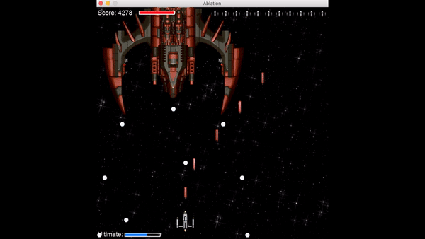
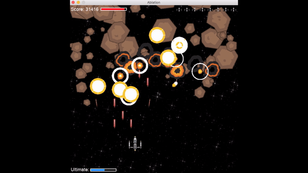
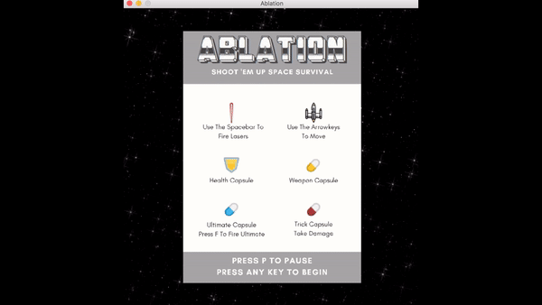
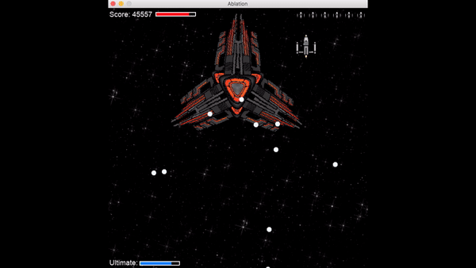

> Spaceship Survival Shoot 'em Up Game

> Navigate your way through asteroid fields and defeat bosses to save the universe.

### What is Ablation?

Ablation is a retro-style vertically scrolling shooter. It is designed to feel like a 90's style arcade game with overhead 2-D graphics. Your objective is to safely navigate through asteroid fields and vanquish five bosses that have been terrorizing the universe. 

### How to download and play Ablation

1. First, make sure that you have Python installed. Go to your Command Prompt and type python --version
1. If you already have Python 3, you're all set. If not, go to https://www.python.org/downloads/ and install Python 3.
1. Click the green Clone button on this GitHub Directory and click Download ZIP.
1. In your downloads folder, there will be a folder called Ablation-master. Open your Command Prompt and type cd/downloads/ablation-master and press enter
1. Now type python main.py
1. Ablation should open! It's time to go save the universe!

### What is PyGame?

### Tips and Tricks to keep in mind while Playing

* Large asteroids do way more damage than small ones. Make sure to avoid the big ones at all costs!
* Getting as many capsules as you can is very important - especially the yellow ones. They give you weapon upgrades and allow you to kill more asteroids and unlock even more capsules!
* But watch out, the red capsules do a lot of damage! Avoid them.
* As time passes, more and more asteroids will spawn. Use your ultimate (f) to permanently destroy some of the asteroids.
* Make sure not to use your ultimate right as a level ends. You want to permanently kill as many asteroids as possible!
* Be patient during boss fights. Make sure to avoid boss lasers as they kill you in one hit. It's better to take a few hits from boss bullets than die to a laser.
* You move slightly faster at a diagonal - use this to to dodge close calls!
* Have fun and save the universe! 

### Why did I create Ablation?

My goal was to create a game using PyGame in order to improve my Python skills and learn new techniques. I chose to build a spaceship shoot 'em up game because I have fond childhood memories of playing an old arcade game called Raiden - which is where I got the inspiration for this game. 

### What I learned while making this game?

I certainly learned a lot of new and interesting techniques that I can take with me as I move on to future, more complex projects. More importantly I learned a lot of things that didn't work well that I will now be able to easily avoid in the future. 
* Stick to a strict OOP style. Keeping different classes and functions organized into separate .py files will help keep the program organized and progress moving quickly.
* Include error testing in the code by using exception handling to pinpoint coding errors with ease.
* While I included notes and labeled my variables well - including even more notes would be helpful for anyone reading the code in the future. In addition, creating a labeling system for variables and files from the start of the program will help keep everything organized.
* Use Git to allow multiple programmers easily work together to commit or revert changes.